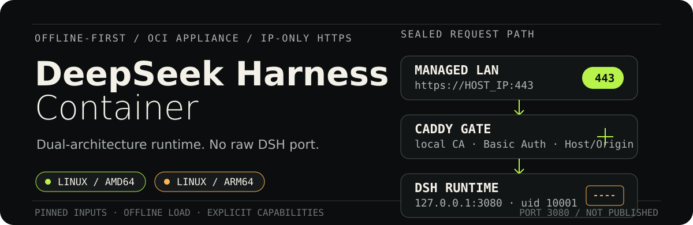

# DeepSeek Harness Container

<p align="center">
  
</p>

Reproducible, offline-first container delivery for DeepSeek Harness on Linux
AMD64 and ARM64, with an authenticated IP-only HTTPS entry and an explicit
development capability boundary.

## Project status

**DSH `0.1.1-rc.2` now has local native AMD64 and QEMU ARM64 candidates. Both
passed the shared runtime and native-module boundary; the default Caddy and
isolated HAProxy gateway profiles passed local dual-architecture tests. An
isolated AMD64 rc.2 appliance is running locally on HTTPS 8443 for validation.
No image has been pushed, published, released or deployed to production.**

The rc.1 local and GitHub-native candidates remain historical evidence. The
current rc.2 source uses
the exact Node `24.19.0-bookworm-slim` image only as the build
stage and copies DSH into pinned, shell-less Distroless Node 24 Debian 13
runtime children. AMD64-native and ARM64-QEMU images passed the
network-disabled runtime/native-module boundary. A same-tool/database scan
reduced DSH High/Critical matches from 24 to 4 on both architectures; the
pinned Caddy image has 35 matches on each scanned architecture. The Docker Hub workflow
therefore remains fail-closed; this is not yet a publishable image or
production-ARM acceptance.

An isolated HAProxy `3.4.3-alpine3.24` alternative now passes the same local
gateway contract on native AMD64 and QEMU ARM64, including real DSH Compose
startup, trusted IP-SAN TLS/no-SNI, 401/200/421/403, upstream header removal,
WebSocket, SSE and no published 3080. Both exact HAProxy children scan at two
High records (one advisory) each, making the comparable DSH+HAProxy appliance
six records per architecture. That is an improvement, not a release approval:
native production ARM, formal retained supply-chain evidence and the empty-
exception policy still block adoption. Caddy remains the default profile.
The native AMD64/ARM64 build-only workflows contain this isolated test.
Historical rc.1 runs `32664544119` and `32664545874` passed it on source
`8b9ce04…`; HAProxy
remains an isolated non-publishing profile and is not included in the default
Caddy bundle.

The current rc.2 AMD64 candidate records manifest `sha256:3cea6dff…` and config
`sha256:783f744f…`; the QEMU ARM64 candidate records manifest
`sha256:0c1fe2ec…` and config `sha256:c3511761…`. Both load Koffi, node-pty,
Landlock and Sharp with networking disabled and pass the loopback Web,
read-only-root and UID 10001 checks. Caddy and HAProxy Compose acceptance passed
on native AMD64 and QEMU ARM64. The persistent local AMD64 test appliance was
upgraded in place to rc.2 and passed trusted-CA WebUI, 401/200/421/403 and
no-container-3080 checks on port 8443 without changing the host systemd DSH.
The last GitHub-native evidence is still historical rc.1. GitHub
[native AMD64 run 32664544119](https://github.com/dff652/deepseek-harness-container/actions/runs/32664544119)
rebuilt source `8b9ce04…`, producing DSH manifest `sha256:fb8fad14…` and
config `sha256:49d9d255…`. GitHub
[native ARM run 32664545874](https://github.com/dff652/deepseek-harness-container/actions/runs/32664545874)
produced manifest `sha256:101a1b8a…` and config `sha256:0477a2f1…` from the
same source. Every downloaded bundle member, generated lock, architecture,
DSH manifest/config digest and portable Caddy archive tag was independently
rechecked. Both locks still record null SBOM/provenance fields. Real
disconnected production-ARM acceptance remains open.

This repository was created to separate the OCI/Compose release lifecycle from
the configuration-only plugin packages in the sibling
`deepseek-harness-plugins` project. The currently running host installation is
not changed by this scaffold. That existing DSH instance is a host/user-level
Node/pnpm installation managed by user systemd; it is not running inside the
Caddy container and is not converted to containers by creating this project.

The candidate targets this exact tuple:

| Component | Candidate pin | State |
|---|---:|---|
| DeepSeek Harness | `0.1.1-rc.2` | local AMD64 and QEMU ARM64 candidates passed; native GitHub rc.2 and production ARM pending |
| DSH tag/commit | `dsh-v0.1.1-rc.2` / `b150a551b8d465e31e418e1b2eaf5e79bbb7d28e` | Tag commit and npm integrity independently pinned; npm metadata does not bind them cryptographically |
| Node.js | `24.19.0` | Bookworm build image plus Distroless Debian 13 production runtime locked per architecture |
| pnpm | `11.7.0` | Locked with Corepack integrity |
| Caddy | `2.11.4` | OCI index plus AMD64/ARM64 child digests locked |
| HAProxy alternative | `3.4.3-alpine3.24` | isolated exact-child local/GitHub-native AMD64/ARM64 PoC passed; not adopted |
| Production target | `linux/arm64`, glibc | rc.2 QEMU passed; GitHub-native evidence is historical rc.1; rc.2 native and production ARM pending |
| Local test target | `linux/amd64`, glibc | native runtime and Compose/Caddy acceptance passed |

No `latest`, branch head, machine path, private IP, credential or unresolved
release digest is accepted in a release candidate.

The GitHub tag page's automatic `zip` and `tar.gz` downloads are source-tree
snapshots. They are useful for source review and source builds, but they are
not prebuilt ARM64 installers and do not contain the npm dependency closure.
The container plan therefore consumes the exact published npm package plus a
committed pnpm lock/build policy. Its integrity-locked pnpm store is fetched in
the networked image-build stage, then used offline for installation; the
runtime and disconnected target perform no package download. A GitHub source
archive is never renamed and treated as an offline installer.

## Build a local candidate

The repository keeps one Dockerfile and architecture-specific immutable base
image references. On an x86_64 build host with the reviewed Buildx builder:

```sh
./scripts/build-amd64-candidate.sh
```

This writes a candidate-only directory under `artifacts/` containing the DSH
and Caddy Docker archives, Compose files, environment-specific image lock,
inspect/build metadata and `SHA256SUMS`. It also runs the network-disabled
native-module and Web smoke before packaging.

`.github/workflows/build-amd64.yml` provides the corresponding GitHub-hosted
native AMD64 build/runtime/bundle evidence without registry credentials or
image publication. It is separate from the manual Docker Hub publication
workflow. Native run
[32664544119](https://github.com/dff652/deepseek-harness-container/actions/runs/32664544119)
passed these gates for source `8b9ce04…`; its downloaded artifact and internal
checksums were independently verified, including classic-store clean loading.

The ARM64 paths remain separate evidence levels:

- `scripts/build-candidate.sh` builds a local x86/QEMU ARM64 candidate;
- `.github/workflows/build-arm64.yml` builds and smokes on native
  `ubuntu-24.04-arm`;
- the disconnected production-class ARM host performs final import, browser,
  model/MCP, restart and cold-boot acceptance.

`scripts/prepare-local-builder.sh` changes host binfmt state and is required
only when intentionally enabling the reviewed local QEMU builder. Inspect it
before running it.

## Candidate publication

The manual Docker Hub workflow maintains three candidate-only tags:

```text
dff652/deepseek-harness-container:0.1.1-rc.2-amd64-candidate
dff652/deepseek-harness-container:0.1.1-rc.2-arm64-candidate
dff652/deepseek-harness-container:0.1.1-rc.2-candidate
```

The last tag is a manifest list containing exactly Linux AMD64 and ARM64. The
workflow requires the literal confirmation `publish-candidate`, first scans
the complete Git history for secrets, then builds and smokes on native GitHub
runners. Syft generates DSH and Caddy SBOMs from the actual images; Grype scans
those exact SBOMs; repository policy checks licenses, unapproved High/Critical
matches, source revision, platform and digests. Only after both architecture
jobs pass does a separate job download the approved image archives, log in,
push the architecture tags and create the manifest from resolved child
digests. Existing candidate tags are never replaced.

This Docker Hub repository publishes the DSH runtime image only. Caddy remains
the separately pinned Docker Official Image referenced by Compose; it is
scanned as part of the appliance gate but is not copied into this repository.
The offline bundle produced by the architecture build scripts contains both
DSH and the exact Caddy child archive.

The repository secrets `DOCKERHUB_USERNAME` and `DOCKERHUB_TOKEN` are required
only by that final job and are not configured yet. The workflow never writes
`latest`; formal version tags, signed registry attestations and production use
remain gated by the release checklist and real ARM acceptance.

See [dual-architecture maintenance and publication](docs/release-maintenance.md)
for the update order, tag policy and rollback contract. The
[vulnerability triage runbook](docs/vulnerability-triage.md) records the
historical 59-match hold, the verified 39-match Distroless remediation
snapshot, and the remediation/exception boundary.
The [rc.2 release-readiness record](docs/rc2-release-readiness.md) separates
what passed locally from the native-ARM, feature-regression, supply-chain and
owner-authorization gates that remain open.

## Design boundaries

1. Keep this as an independent public project with no deployment secrets. It owns Dockerfiles,
   Compose, Caddy, image locks, SBOM/provenance and offline bundles; it does not
   own DSH source, plugin logic or provider business logic.
2. Keep DSH on container loopback. The selected gateway sidecar joins the DSH
   network namespace with `network_mode: service:dsh`; only the selected host
   IP and HTTPS port are published. The external port defaults to 443 and may
   be changed for an isolated parallel candidate. Caddy remains the default;
   HAProxy is isolated.
3. Treat x86 Buildx/QEMU output as a candidate only. Production acceptance must
   run on a real ARM64 host with networking disconnected.
4. Give an Agent explicit capabilities instead of “host escape”: one approved
   workspace, a versioned development toolchain and allowlisted service
   endpoints. Host administration and image builds use a separate runner.
5. Define “ready to use” as verified image import plus small deployment-owned
   initialization: fixed IP, bcrypt hash, absolute workspace, client CA trust
   and model/provider credentials. Secrets are never baked into an image.

## Intended architecture

```text
managed LAN browser
  -> https://ARM_IP:HTTPS_PORT + Basic Auth + trusted local CA
  -> Caddy sidecar
       network_mode: service:dsh
  -> DSH 127.0.0.1:3080
       + persistent DSH_HOME
       + explicit /workspace
       + approved model/MCP endpoints
```

A one-shot, network-disabled `caddy-init` service creates only
`/data/caddy` and `/config/caddy` for UID/GID `1000:1000`; the long-running
Caddy process stays non-root. DSH remains fixed at `10001:10001`, so the host
workspace must be prepared for that identity.

The host never publishes port 3080. The default design also forbids host
networking, privileged containers, Docker socket mounts, broad host mounts and
`SYS_ADMIN`/`NET_ADMIN`.

Caddy is not required for the existing host/systemd installation: one
administrator can SSH-forward that host's DSH loopback listener. In the
container topology, however, host SSH cannot reach a loopback socket inside a
different network namespace. A same-namespace relay is still required; this
project deliberately uses Caddy so multiple managed LAN devices get an
authenticated HTTPS endpoint by IP while DSH keeps its upstream loopback trust
boundary. Publishing raw DSH HTTP by IP is not the accepted alternative.
Caddy is the current baseline, not an irreplaceable component: the
[gateway-alternatives decision](docs/gateway-alternatives.md) records the
completed isolated HAProxy comparison, keeps NGINX and Traefik as alternatives,
and defines why a project-owned lightweight relay is a last resort rather than
the immediate response to the current Caddy publication hold.

## Documentation

- [Architecture and product boundaries](docs/architecture.md)
- [Offline ARM64 delivery SOP](docs/offline-airgap.md)
- [Local and GitHub dual-architecture build strategy](docs/build-strategy.md)
- [Agent development capability boundary](docs/agent-development-boundary.md)
- [Python SDK headless deployment evaluation](docs/python-sdk-evaluation.md)
- [Security policy](SECURITY.md)
- [Dual-architecture maintenance and publication](docs/release-maintenance.md)
- [Vulnerability triage and publication hold](docs/vulnerability-triage.md)
- [Gateway alternatives and lightweight relay decision](docs/gateway-alternatives.md)
- [HAProxy dual-architecture offline PoC](docs/haproxy-poc.md)

## Implemented candidate outputs

```text
Dockerfile
compose.yaml
compose.amd64.yaml
Caddyfile
compose.haproxy.yaml
haproxy/
  haproxy.cfg.tmpl
runtime/
  package.json
  pnpm-lock.yaml
  pnpm-workspace.yaml
policy/
  image-lock.json
  haproxy-poc-lock.json
  license-policy.json
  native-arm64-lock.json
  supply-chain-tools.json
  vulnerability-allowlist.json
scripts/
  prepare-local-builder.sh
  build-candidate.sh
  build-amd64-candidate.sh
  check-supply-chain-policy.py
  haproxy-test-pki.sh
  render-haproxy-config.py
  save-pinned-image.sh
tests/
  amd64-compose-contract.sh
  amd64-runtime.sh
  compose-contract.sh
  negative-exposure.sh
  amd64-workflow-contract.sh
  native-workflow-contract.sh
  caddy-volume-init.sh
  arm64-runtime.sh
  dockerhub-workflow-contract.sh
  haproxy-contract.sh
  haproxy-runtime.sh
  haproxy-compose-runtime.sh
  offline-image-archive.sh
  supply-chain-policy.py
assets/readme/
  hero.svg
```

The non-publishing build workflows live at `.github/workflows/build-amd64.yml`
and `.github/workflows/build-arm64.yml`. Repository policy records local/QEMU
and native GitHub outputs as candidate-only. Each new ARM64 or AMD64 bundle
generates an environment-specific candidate lock. `image-lock.json` records the
current Distroless QEMU output; `native-arm64-lock.json` preserves the earlier
hardened native run. The latest native ARM64 lock is retained in run
`32664545874`; the matching native AMD64 lock is retained in run `32664544119`.
These candidate locks deliberately retain null SBOM/provenance fields.
The Docker Hub workflow generates separately hashed Syft/CycloneDX SBOMs,
Grype reports, license-policy results and BuildKit metadata for future
candidates; these are candidate evidence, not signed registry attestations.

## Release boundary

A successful image build is not a release. The first candidate must prove:

- exact image architecture, DSH/Node/pnpm/Caddy/provider identities;
- SBOM, provenance, license, vulnerability and secret gates;
- disconnected `docker compose up --no-build --pull never`;
- no published 3080 or dangerous host capability;
- selected gateway unauthenticated 401, authenticated 200 and trusted client
  certificate;
- authenticated requests with malicious Host/Origin/cross-site metadata denied
  before loopback header adaptation;
- real browser settings, model request and MCP tool call;
- workspace-only writes, provider failure/reconnect and child cleanup;
- restart, exact-address cold boot and rollback on real ARM64.

Commit, push, repository visibility, registry publication, signing, release and
deployment remain separate owner-authorized operations.

## Upstream references

- [DeepSeek Harness `dsh-v0.1.1-rc.2`](https://github.com/deepseek-ai/deepseek-harness/tree/dsh-v0.1.1-rc.2)
- [Docker Compose networking modes](https://docs.docker.com/compose/how-tos/networking/#change-the-network-mode)
- [Docker multi-platform builds](https://docs.docker.com/build/building/multi-platform/)
- [Docker daemon attack surface](https://docs.docker.com/engine/security/#docker-daemon-attack-surface)
- [Caddy local HTTPS](https://caddyserver.com/docs/automatic-https#local-https)
- [Reviewed community container reference](https://github.com/runzhliu/deepseek-harness-docker)

The community project is implementation evidence, not an official DeepSeek
image and not this project's acceptance evidence.
